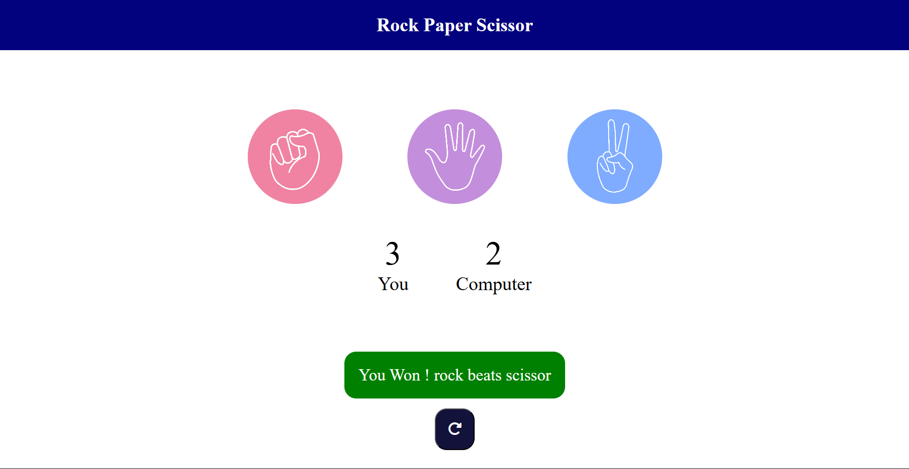

# ✊ Rock Paper Scissors 🎮

A classic **Rock Paper Scissors** game built using **HTML**, **CSS**, and **JavaScript**.  
Play against the computer and enjoy smooth animations and instant results!

---

## 🚀 Live Demo

🌐 [Click here to play](https://RishiChauhan011.github.io/html-css-js/rock-paper-scissors/)  

---

## 📸 Preview

  

---

## 🛠️ Tech Stack

- **HTML** – Structure of the game
- **CSS** – Stylish and responsive design
- **JavaScript** – Game logic and interaction

---

## 🎯 Features

✅ Simple and responsive UI  
✅ Random computer choice  
✅ Score tracker  
✅ Reset button  
✅ Cool images and hover effects

---

## 🧠 How It Works

1. Player chooses Rock, Paper, or Scissors.
2. Computer randomly selects its move.
3. The winner is determined and score is updated.
4. Game continues until you refresh or reset.

---

## 📂 Folder Structure

rock-paper-scissors/
├── index.html
├── style.css
├── script.js
├── images/
│ ├── rock.png
│ ├── paper.png
│ ├── scissors.png
│ └── preview.png (optional)
└── README.md

---

## 👨‍💻 Author

Made with ❤️ by [Your Name](https://github.com/your-username)

---

## 📢 License

Free to use and modify. No license applied.
